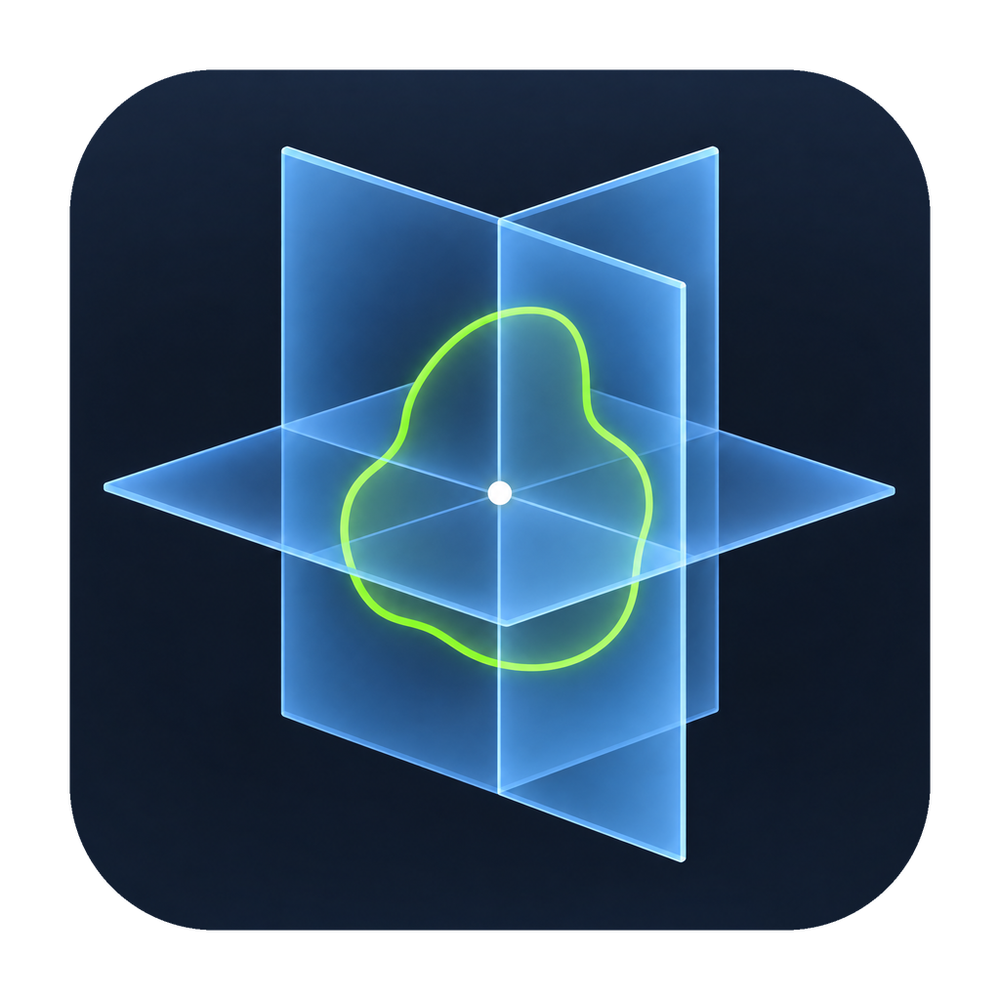

<div align="center">
  

  # RadView3D

  **A native CT and radiotherapy contour viewer for Elekta/CMS Monaco patient folders.**

  [](#)
  [](https://www.rust-lang.org/)
  [](https://tauri.app/)
  [](https://react.dev/)
  [](https://ui.shadcn.com/)
  [](https://tailwindcss.com/)
  [](https://www.typescriptlang.org/)
  [](https://vite.dev/)
  [](#open-source)
</div>

---

## What is RadView3D?

RadView3D is a focused desktop viewer for CT volumes and structure contours exported from **Elekta/CMS Monaco**. The Rust backend loads and prepares the study once; the React/TypeScript frontend keeps the volume in memory for responsive orthogonal slice navigation. The workstation interface is composed from source-owned [shadcn/ui](https://ui.shadcn.com/) components, using its Base UI primitives, Tailwind CSS 4 design tokens, and Lucide icons.

### Highlights

- Axial, coronal, and sagittal CT views
- Monaco DICOM CT and `.WC` contour support
- Structure visibility controls and contour overlays
- A focused shadcn/ui workstation with a full-height CT study and structure sidebar
- Accessible shadcn alert dialogs for destructive actions and a dedicated About dialog
- Soft-tissue, lung, and bone window presets
- Mouse wheel, sliders, and keyboard slice navigation
- A minimal no-study screen; viewer controls appear only after a patient folder is opened
- Patient folders open in the synchronized axial, coronal, and sagittal all-view layout
- A persistent slice slider in every viewport
- Maximized window startup with standard window controls and smoothly animated dialogs
- Copy the patient folder path from the sidebar without exposing the full path in the UI
- Confirmed folder closing and application exit
- Native Tauri desktop application with standalone binaries

> **Current scope:** Monaco patient folders are supported in this version. Varian data, dose viewing, and export workflows are not currently included.

## Download and run

Prebuilt applications are published on the repository’s [GitHub Releases page](../../releases).

### Windows standalone executable

1. Open [GitHub Releases](../../releases).
2. Download the Windows standalone `.exe` asset.
3. Run `RadView3D.exe` directly. RadView3D opens maximized, with the standard minimize, maximize/restore, and close buttons visible.

The standalone executable does not require Node.js, npm, Vite, or a development server. Windows 10/11 should have the WebView2 Runtime available; if Windows asks for it, install the [Microsoft WebView2 Runtime](https://developer.microsoft.com/en-us/microsoft-edge/webview2/).

### Linux binary

1. Open [GitHub Releases](../../releases).
2. Download the Linux binary, typically named `radview3d-linux`.
3. Make it executable and run it:

```bash
chmod +x radview3d-linux
./radview3d-linux
```

## How to use it

### Open a patient folder

1. Launch RadView3D.
2. Select **Open folder** to open the native Windows folder picker through Tauri's built-in dialog plugin.
3. Choose the patient directory, not an individual CT study directory.
4. Wait for the study to load.
5. Use the **CT1 / CT2** selector in the left sidebar if the patient contains multiple CT studies.

A typical Monaco patient directory looks like this:

```text
1~20230127/
├── 1~CT1/
│   ├── DCMData/*.CT.DCM
│   ├── contournames
│   └── T.<z>.WC
└── 1~CT2/
    ├── DCMData/*.CT.DCM
    ├── contournames
    └── T.<z>.WC
```

RadView3D prefers `1~CT2` when it contains DICOM data, then falls back to another DICOM-containing study.

### Navigate the viewer

| Action | Control |
| --- | --- |
| View all panes | `1` or **All** |
| Axial view | `2` or **Axial** |
| Coronal view | `3` or **Coronal** |
| Sagittal view | `4` or **Sagittal** |
| Change slice | Mouse wheel, slider, or arrow keys |
| Move 10 slices | `Page Up` / `Page Down` |
| First or last slice | `Home` / `End` |
| Show or hide contours | Structure checkboxes |
| Change CT window | **Soft tissue**, **Lung**, or **Bone** |
| Close the current folder | **Close folder** |

### Window presets

| Preset | Window level | Window width |
| --- | ---: | ---: |
| Soft tissue | `40` | `400` |
| Lung | `-500` | `1400` |
| Bone | `500` | `2000` |

## Supported data

- CT images: `DCMData/*.CT.DCM`
- Structure names: `contournames`
- Monaco contours: `T.<z>.WC`
- WC contours are matched to CT slices by Z position with a `0.11 mm` tolerance.
- The Monaco Y-axis mapping is applied when rendering contours.

## Build from source

### Requirements

- Node.js 20.19+ (or Node.js 22.12+)
- npm
- Rust stable with Cargo
- shadcn/ui source components are already included under `src/components/ui/`; no UI code is fetched at runtime
- Windows builds: MSVC C++ build tools and a Windows SDK
- Linux builds: WebKitGTK, GTK, AppIndicator, `patchelf`, NSIS, and `zenity`

### Development mode

```bash
npm install
npm run tauri dev
```

On Windows PowerShell, use the `.cmd` wrappers if script execution policy blocks npm:

```powershell
npm.cmd install
npm.cmd run tauri dev
```

The frontend uses Vite + React + TypeScript with Tailwind CSS 4. To add another official shadcn component, run `npx shadcn@latest add <component>` from the project root; the project is configured with the Base UI implementation and Nova visual preset (`components.json`). The CLI is intentionally not a runtime dependency: generated source components are checked in under `src/components/ui/`.

### One-command build and run

After installing the prerequisites, build the standalone native application and launch it with one command:

```powershell
npm.cmd run standalone
```

This runs the frontend build, compiles the Rust release binary with the embedded frontend, and starts the resulting application. Use `npm.cmd run build:standalone` when you want to build without launching it.

### Standalone Windows executable

```powershell
cd D:\Projects\RadView3D
npm.cmd run build
cd src-tauri
cargo build --release --features custom-protocol
```

The executable is created at:

```text
src-tauri\target\release\radview3d.exe
```

### Linux binary

Build on Linux for a native Linux result:

```bash
npm install
npm run build
cd src-tauri
cargo build --release --features custom-protocol
```

The binary is created at:

```text
src-tauri/target/release/radview3d
```

### macOS package

Build on macOS using Apple’s native SDK:

```bash
npm install
npx tauri build --bundles app,dmg
```

## FAQ

### Does the standalone executable need Node.js?

No. Node.js and npm are needed only for development and building. The standalone executable includes the compiled frontend.

### What folder should I select?

Select the patient directory, such as `1~20230127`. Do not select only `1~CT1` or `1~CT2` unless that is the workflow you specifically need.

### Can I open a different patient after opening one?

Yes. Click **Open folder**, choose another patient directory, and wait for the new study to load. Use **Close folder** first if you want to return to an empty viewer.

### Can I build a Linux binary on Windows?

For reliable native output, build Linux binaries on Linux and macOS packages on macOS. Windows standalone executables should be built on Windows.

### Where are release files published?

Open the repository’s [GitHub Releases page](../../releases). Download the asset matching your operating system.

## Open source

RadView3D is an open-source project. Contributions, testing feedback, documentation improvements, and code changes are welcome.

## Author

Developed by **Nishan Khan**.

<div>
  <a href="https://github.com/IamNishanKhan" title="GitHub profile">
    
  </a>
  <a href="https://www.linkedin.com/in/iamnishankhan/" title="LinkedIn profile">
    
  </a>
  <a href="https://www.nishankhan.me/" title="Personal website">
    
  </a>
  <a href="mailto:iamnishankhan@gmail.com" title="Email Nishan Khan">
    
  </a>
</div>
